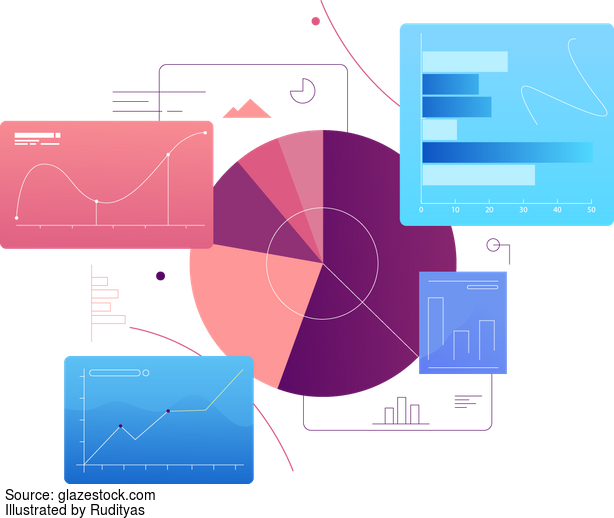

<!--
.. title: Qué es el Data Version Control (DVC) y por qué es necesario que tu equipo sepa cómo utilizarlo
.. slug: que-es-el-data-version-control-dvc-y-por-que-es-necesario-que-tu-equipo-sepa-como-utilizarlo
.. date: 2019-04-08
.. author: Yurely Camacho
.. tags: versioning, data
.. category: data
.. link: 
.. description: 
.. type: text
-->

<!-- # Qué es el Data Version Control (DVC) y por qué es necesario que tu equipo sepa cómo utilizarlo -->
<!-- **Por Yurely Camacho** -->

Cuando colaboramos en proyectos que involucran un manejo y transformación
constante de conjuntos de datos y/o modelos derivados de estos, nos vemos en la
necesidad de indagar y poner en práctica técnicas que permitan tener un
control de todos los cambios realizados en ellos durante la
investigación; para lo cuál se necesitan herramientas que lo hagan
posible. Allí entra en juego el *Control de versiones de datos* o Data
Version Control (DVC).

<!-- TEASER_END -->

En este apartado definimos brevemente el Control de versiones de datos,
mencionamos algunas herramientas o *Sistemas de control de versiones*
que lo hacen posible y también las ventajas que tiene su utilización en
equipos de trabajo.

En nuestro artículo *Investigación Colaborativa con Git* (enlace a
artículo investigacion_colaborativa_con_git) mencionamos que los
*Sistemas de control de versiones* permiten almacenar los cambios
realizados en los archivos en todas sus fases de desarrollo y la
información asociada a ellos (fecha y autoría de los cambios). En la
mayoría de ocasiones se utilizan en entornos de desarrollo de software,
pero son realmente útiles cuando necesitamos un control sobre cualquier
tarea que estemos realizando; en este caso la de transformar conjuntos
de datos y experimentar modelos de Machine Learning, por ejemplo, donde
el seguimiento de todos los pasos y dependencias entre el código y los
conjuntos de datos es fundamental.

En el control de versiones de datos (y en general, de cualquier tipo de
archivo), podemos ver las versiones como "fotografías" que registran el
estado en ese momento del tiempo y se van tomando más fotografías
(guardando nuevas versiones) a medida que se hacen modificaciones,
generalmente, al conjunto de datos, a *scripts* de actualización o
transformación de datos (especificación y prueba de modelos). De tal
forma que podamos experimentar modelos, observar qué modelos funcionaban
con que conjunto de datos, poder reproducir experimentos anteriores o
restaurar la investigación a una versión antigua en cualquier momento.

A continuación se mencionan algunas herramientas de software libre para
el versionado de conjuntos de datos y bases de datos.

- [DVC](https://dvc.org/)
- [Pachyderm](https://www.pachyderm.com/)
- [Liquibase](https://www.liquibase.org/)
- [Dat](https://dat.foundation/)
- [Git lfs](https://git-lfs.github.com/) y [Git-annex](https://git-annex.branchable.com/)

En este punto hablaremos un poco sobre DVC, una de las herramientas más
utilizadas para el versionado de datos actualmente.

### [DVC](https://dvc.org/)

Es una herramienta gratuita y de código abierto empleada, mayormente, en
proyectos de ciencia de datos y Machine Learning. La parte central del
DVC es el versionado de datos para archivos grandes, versionado de
modelos Machine Learning, de conjuntos de datos, flujo de trabajo,
facilitando la colaboración y la reproducibilidad. Como DVC hace que los
proyectos sean reproducibles y compartibles; podemos saber cómo se
construyeron y probaron los modelos y cómo han sido transformados los
datos originales. DVC está basado en \[Git\](enlace a artículo
GitCeroACien); aunque puede funcionar de manera autónoma (pero sin
capacidad de versionado). "Es como un Git para Datos".

Esta herramienta se desarrolló en un 98% bajo el lenguaje de
programación \[Python\](enlace a artículo 10razonesparausarpython).

#### Características principales

- DVC funciona sobre los repositorios de Git y tiene una interfaz y un
  flujo de línea de comandos similares a este.

- No requiere la instalación y el mantenimiento de bases de
  datos.

- Puede ser ejecutado en los principales sistemas operativos (Linux,
  Windows y MacOS). Funciona independientemente de los lenguajes de
  programación o de las bibliotecas de Machine Learning utilizados en el
  proyecto.

- Es rápido de instalar, no depende de APIs o servicios externos.

[Aquí puedes acceder al Repositorio de GitHub del proyecto DVC](https://github.com/iterative/dvc)

## Ventajas de implementar el control de versiones de datos

El tener un seguimiento de los cambios en conjuntos de datos y scripts
de especificación y prueba de modelos de datos en el desarrollo de una
investigación, tanto personal como colaborativa, proporciona una serie
de beneficios o ventajas como las mencionadas a continuación:

- Guardan toda la historia del proyecto.

- El trabajo en equipo es más sencillo, debido a la especificación de
  fechas y autorías de cambios; aumentando la capacidad de colaborar en
  un proyecto.

- Permite el acceso compartido a los archivos y el desarrollo de ramas o
  branches para experimentar cambios.

- No te preocupes si alguien comete un error o sobrescribe algo
  importante, puedes volver a versiones anteriores en cualquier momento.

- Hace más fácil la reproducibilidad de modelos de aprendizaje
  automático en ciencia de datos.

- Permite que los desarrolladores de un proyecto que trabajan en un mismo
  archivo de datos, combinen de forma eficiente las ideas y cambios.

En OpenScienceLasbs te invitamos a que implementes el versionado de
datos y de modelos Machine Learning con DVC u alguna otra herramienta
para que tu equipo de trabajo ejecute proyectos de manera más eficiente
y pueda llevar un seguimiento adecuado de los cambios de los conjuntos de datos y modelos durante todas las fases del proyecto.

#### Referencias

- [Herramientas de control de versiones](https://blog.dinahosting.com/herramientas-de-control-de-versiones/)

- [Website oficial de la herramienta DVC](https://dvc.org/)
